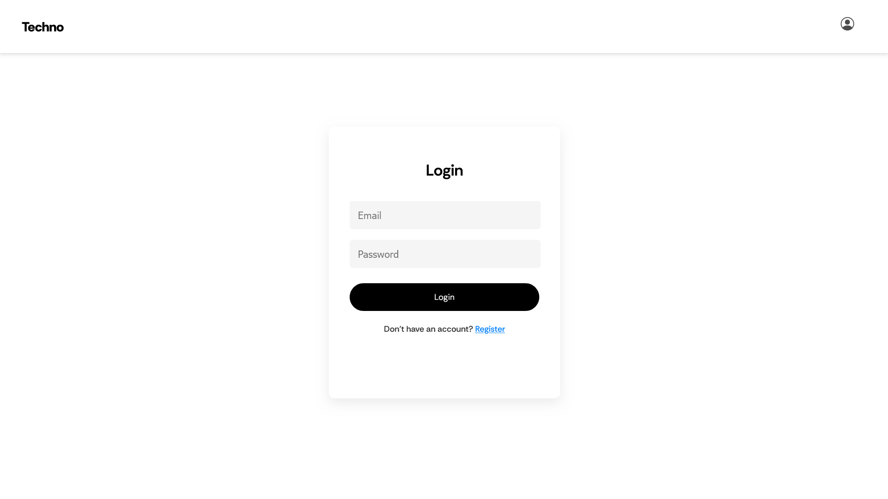
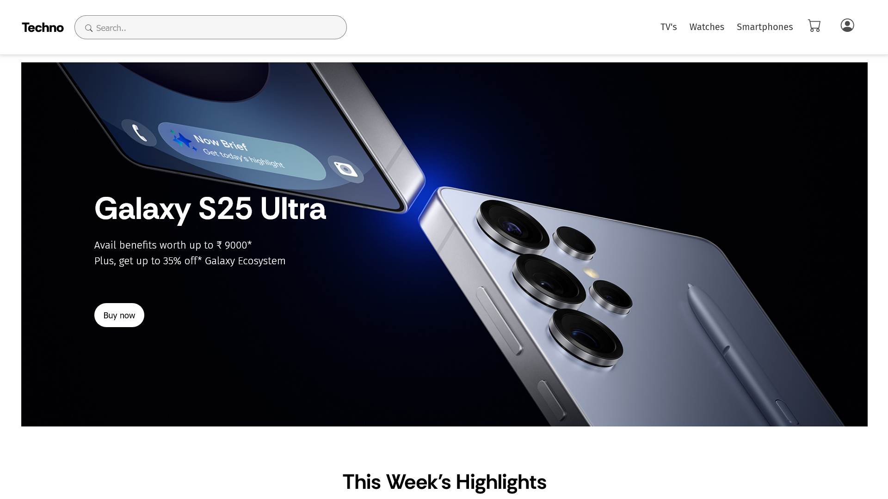
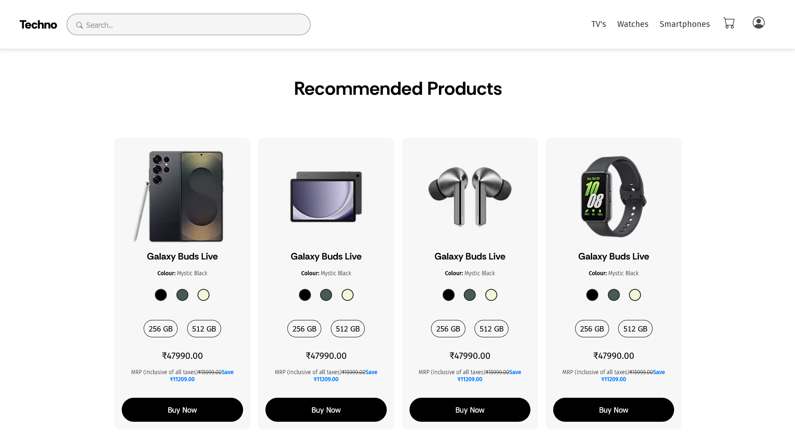
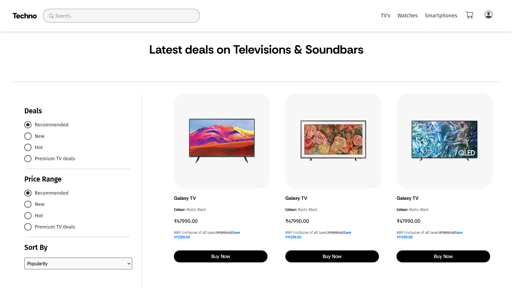
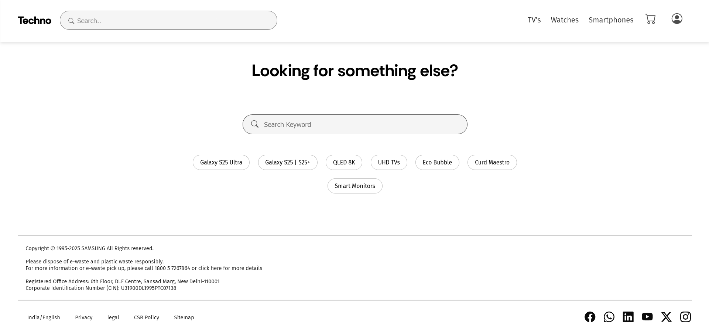

# Techno

Techno is a simple and clean electronic store website built using only HTML and CSS. It features a modern design layout showcasing tech products, highlighting key sections like a homepage banner, product listings, and footer. This project focuses on frontend design and is fully responsive for different screen sizes

## Technologies

## Login/Register

## Home Page

## Filter And Products

## Footer Section

